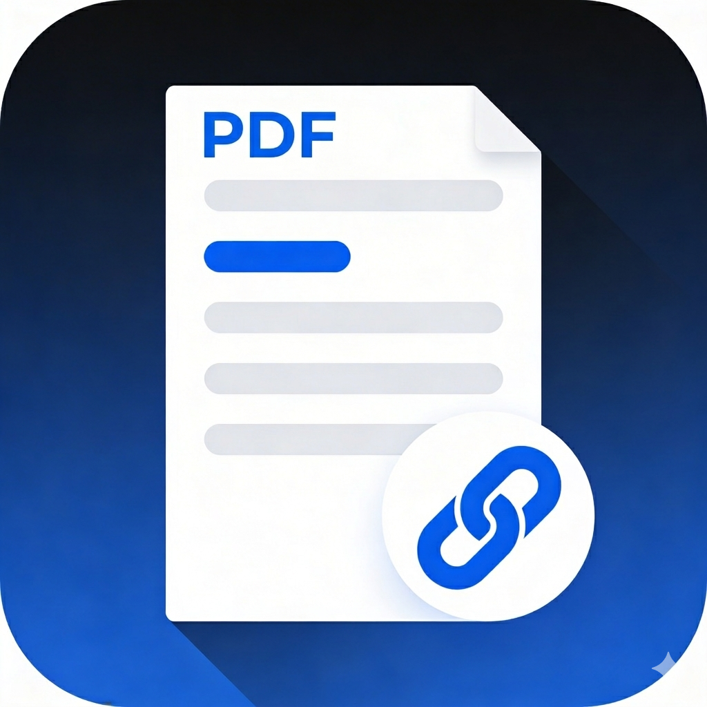
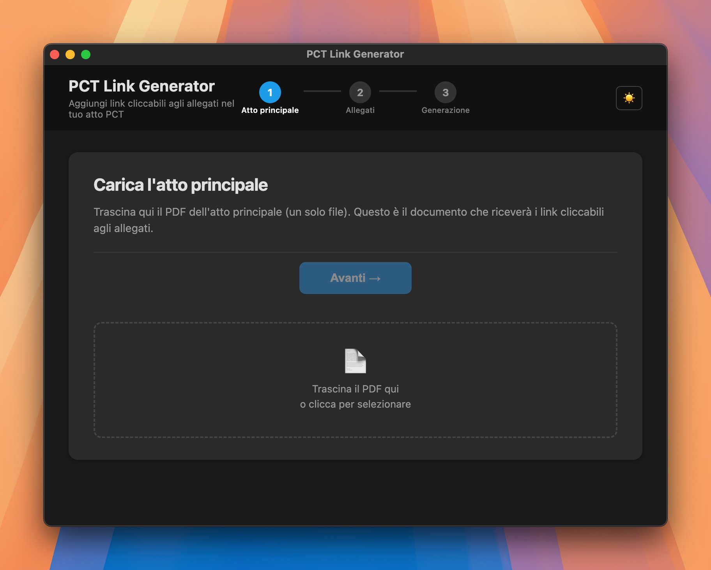
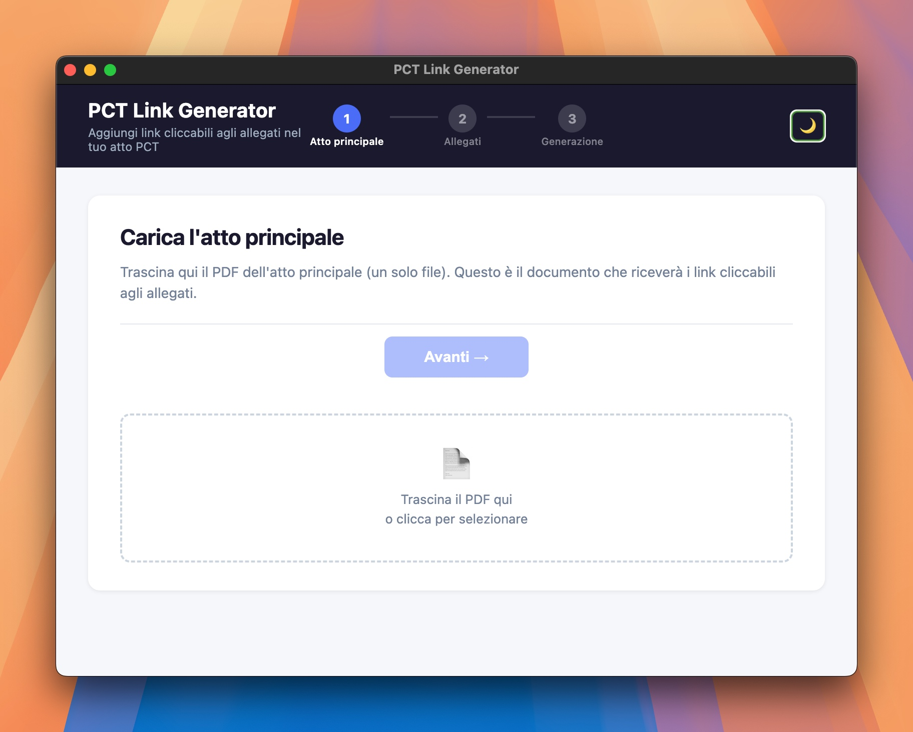

# PCT Link Generator

<p align="center">
  
</p>

App desktop per aggiungere link cliccabili agli allegati negli atti PCT — creata da un avvocato, con l'aiuto dell'intelligenza artificiale (vibe coding), senza conoscenze di programmazione.

<p align="center">
  
  &nbsp;
  
</p>

---

## Indice

- [Come funziona?](#come-funiziona?)
- [Download](#download)
- [Installazione su macOS](#installazione-su-macos-dmg)
- [Installazione su Windows](#installazione-su-windows-exe)
- [Privacy](#privacy)
- [Logica di ricerca](#logica-di-ricerca)
- [Per sviluppatori](#per-sviluppatori)

---

## Come funziona?

1. Trascini il PDF dell'atto principale (Step 1) — l'app mostra un'anteprima sfogliabile del documento (con pulsanti ‹ / › per navigare le pagine);
2. Trascini uno o più allegati (PDF, EML, MSG, JPG, XML…), riordinabili con drag & drop (Step 2);
3. Scegli il numero di partenza (default: 1) e, se vuoi, uno schema di rinomina automatica dei file nell'output (es. `01_`, `doc_01_`, `allegato_01_`);
4. Rivedi il riepilogo nella modale di anteprima prima di confermare;
5. L'app cerca automaticamente nell'atto tutti i riferimenti agli allegati per posizione (`doc. 1`, `allegato 1`, `documento n. 1`, `all. 1`…) e aggiunge una sottolineatura blu con link cliccabile che apre il file allegato;
6. Salva l'atto modificato e tutti gli allegati nella cartella di output scelta.

**Uso tipico:** avvocati e professionisti che depositano atti telematici del Processo Civile Telematico (PCT).

> Per approfondire la tecnica dei collegamenti ipertestuali tra atto e allegati, leggi l'articolo: [**PCT: come fare i collegamenti iper-testuali tra l'atto principale e gli allegati depositati**](https://avvocati-e-mac.it/blog/2015/9/18/pct-come-fare-i-collegamenti-iper-testuali-tra-latto-principale-e-gli-allegati-depositati?rq=collegamenti%20allegati)

---

## Download

Scarica l'ultima versione dalla pagina [**Releases**](https://github.com/avvocati-e-mac/pct-link-generator/releases/latest):

| Sistema operativo | File da scaricare |
|---|---|
| **macOS — Apple Silicon** (M1/M2/M3/M4) | `PCT-Link-Generator-*-arm64.dmg` |
| **macOS — Intel** (x64) | `PCT-Link-Generator-*-x64.dmg` |
| **Windows** (x64) | `PCT-Link-Generator-*-x64.exe` |
| **Linux** (x64) | `PCT-Link-Generator-*-x86_64.AppImage` |

> **Non sai quale Mac hai?** Clicca sul menu  (in alto a sinistra) → "Informazioni su questo Mac". Se vedi "Chip: Apple M…" scarica la versione **ARM64**, altrimenti scarica la versione **Intel**.

---

## Installazione su macOS (DMG)

L'app non è notarizzata da Apple. Al primo avvio macOS la mette in quarantena e blocca l'apertura.

**Prima di avviare l'app**, esegui questo comando nel Terminale:

```bash
sudo xattr -cr /Applications/pct-link-generator.app
```

> Sostituisci il percorso se hai installato l'app in una cartella diversa da `/Applications`.

Questo comando rimuove l'attributo di quarantena e permette l'avvio normale.

---

## Installazione su Windows (EXE)

### Il problema con Microsoft Edge e SmartScreen

Quando scarichi il file `.exe` con **Microsoft Edge** (il browser predefinito di Windows), potresti vedere uno o entrambi questi blocchi:

**Blocco 1 — Edge blocca il download:**

> *"PCT-Link-Generator-Setup.exe non è comunemente scaricato e potrebbe danneggiare il dispositivo."*

**Blocco 2 — Windows SmartScreen blocca l'avvio:**

> *"Il PC è stato protetto — Windows SmartScreen ha impedito l'avvio di un'app non riconosciuta."*

Questi avvisi compaiono perché l'app non ha ancora un numero sufficiente di download per essere "riconosciuta" da Microsoft come sicura — non perché sia pericolosa. L'app non si connette a internet e non contiene virus.

---

### Come scaricare il file con Edge (passo per passo)

**1.** Clicca sul link di download del file `.exe` nella pagina Releases.

**2.** In basso nella finestra di Edge apparirà una barra di notifica. Clicca sui **tre puntini** `...` a destra del nome del file.

**3.** Nel menu che appare, clicca su **"Mantieni"**.

**4.** Nella schermata successiva clicca su **"Mostra altre opzioni"**.

**5.** Clicca su **"Mantieni comunque"**.

Il file `.exe` verrà salvato nella cartella Download.

---

### Come avviare l'app per la prima volta (SmartScreen)

**1.** Vai nella cartella **Download** e fai doppio clic sul file `.exe`.

**2.** Apparirà una finestra blu con scritto *"Windows ha protetto il PC"*. **Non cliccare "Non eseguire".**

**3.** Clicca su **"Ulteriori informazioni"** (scritta in piccolo, sotto il messaggio).

**4.** Apparirà il pulsante **"Esegui comunque"** — cliccalo.

**5.** L'installazione si avvierà normalmente. Al termine, l'app si apre in automatico.

> Questo avviso compare solo la **prima volta**. Dai successivi avvii l'app si aprirà direttamente.

---

## Privacy

Zero connessioni di rete. Tutto viene elaborato localmente sul tuo computer. GDPR compliant.

---

## Logica di ricerca

Il software associa ogni allegato alla sua **posizione** nella lista (partendo dal numero che scegli tu). Per ogni posizione cerca nell'atto tutte le varianti italiane comuni:

- `doc. 1`, `Doc.1`, `DOC. 1`
- `allegato 1`, `Allegato 1`
- `documento 1`, `Documento n. 1`
- `all. 1`, `All. 1`, `att. 1`
- `allegato n. 1` (con `n.` intermedio tra prefisso e numero)

Pattern non supportati (es. `doc. 1bis` senza spazio tra numero e "bis"): vengono rilevati e segnalati con un avviso, così sai quali riferimenti non hanno ricevuto un link.

---

## Per sviluppatori

### Stack

| Componente | Tecnologia |
|---|---|
| Shell desktop | Electron 33 |
| UI | HTML/CSS/JavaScript vanilla |
| Estrazione testo PDF | mupdf (coordinate per-carattere) |
| Scrittura annotazioni PDF | pdf-lib |
| Test | Vitest |

### Avvio in sviluppo

```bash
npm install
npm start
```

### Test

```bash
npm test
```

78 test Vitest, tutti verdi.

### Struttura

```
src/
├── main/
│   ├── main.js            # Entry point Electron, IPC handlers
│   ├── preload.js         # contextBridge → window.electronAPI
│   └── pdf-processor.js  # Logica PDF (mupdf + pdf-lib)
├── renderer/
│   ├── index.html         # UI multi-step drag & drop
│   ├── renderer.js        # Logica UI
│   └── style.css
└── shared/
    └── types.js           # Costanti IPC + typedef JSDoc
tests/
└── pdf-processor.test.js
```

### Roadmap

- [x] Fase 1 — Scaffolding
- [x] Fase 2 — Core services (findTextCoordinates, addUnderlineLink)
- [x] Fase 3 — IPC e Preload
- [x] Fase 4 — UI Renderer
- [x] Fase 5 — Test (65/65 verdi)
- [x] Fase 6a — UI multi-step, drag & drop riordino, modale anteprima
- [x] Fase 6b — Regex sinonimi italiani PCT, prefisso obbligatorio, rilevamento bis/ter
- [x] Fase 6c — Dark mode, anteprima PDF, startIndex, rinomina allegati, verifica natività
- [x] Fase 6d — Anteprima PDF via mupdf (immagine adattiva, navigazione multi-pagina), pulsante Esci
- [x] Fase 7 — UX: progress bar indeterminata, notifica nativa al termine, apertura cartella output, pulsante Esci, step indicator nel header
- [x] Fase 7b — UI polish: layout 2 colonne responsive nello step 1, anteprima PDF a tutta larghezza, pulsanti step 2 e 3 riposizionati, step 3 con pulsante ← Indietro
- [ ] Fase 8 — Packaging (electron-builder, DMG/EXE)

### Note tecniche

- **Coordinate:** mupdf restituisce coordinate per-carattere in sistema top-left (Y↓). La conversione a sistema pdf-lib (bottom-left, Y↑) avviene solo in `addUnderlineLink`: `yPdfLib = pageHeight - y - height`.
- **Link relativi:** le Launch action usano `PDFString` per i path — compatibile con Acrobat e Foxit.
- **Sicurezza Electron:** `contextIsolation: true`, `nodeIntegration: false`, comunicazione esclusivamente via `contextBridge` + `ipcRenderer.invoke`.
